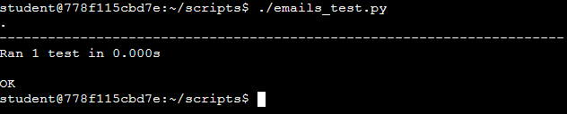
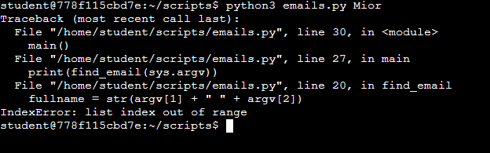
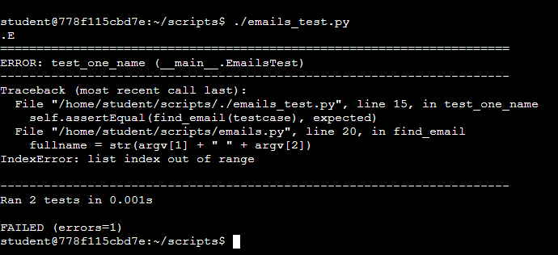
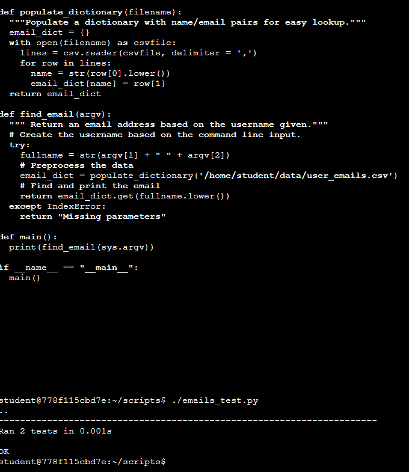
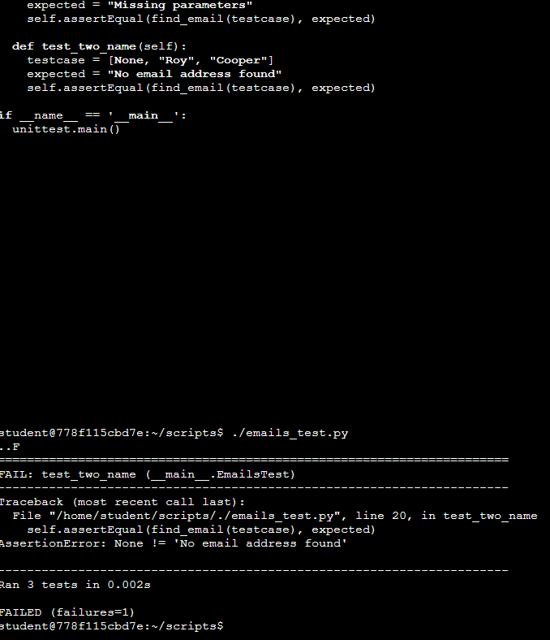
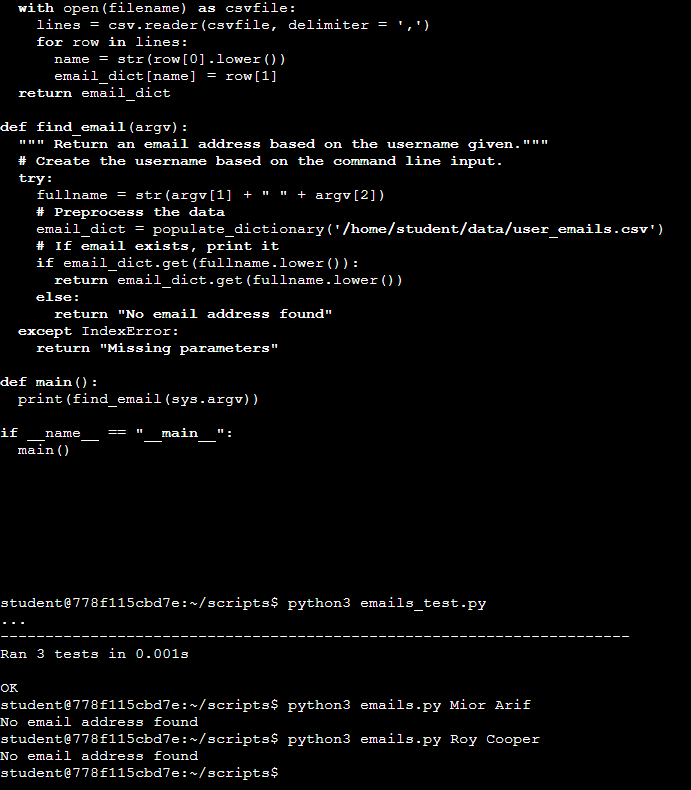

# unittest 🐍🧪🐛
 unittest : Unit Testing # Python # Bug Fixes # Try Except # Assertion # Missing parameters 

## Objective
- To add a test to reproduce bug & make the necessary corrections
    -  Script: emails.py (matches users to an email address & lets user easily look them up)
- Write a simple test to check for basic functionality
- Write a test to check for edge cases
    - Test Case 1: Missing parameters
    - Test Case 2: Random email address
- Correct code with a try/except statement

## Python Unit Testing

